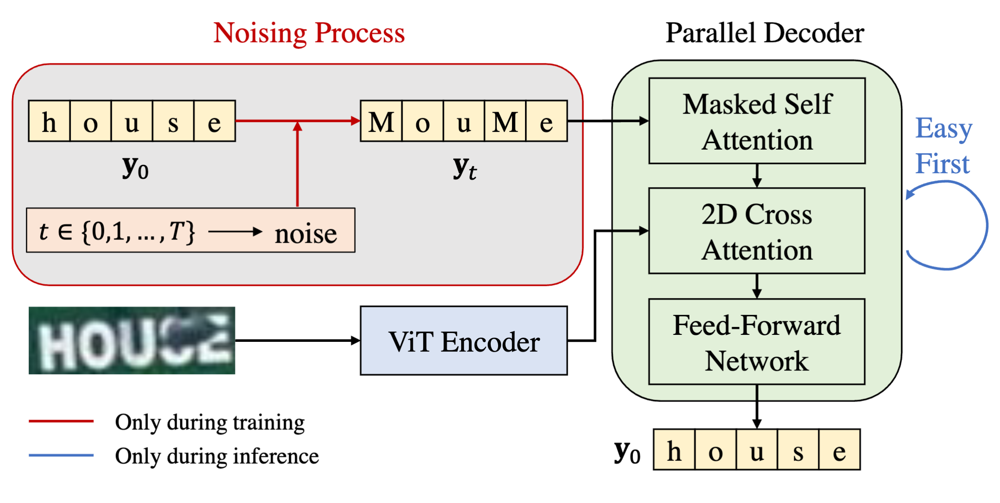

# IPAD: Iterative, Parallel, and Diffusion-based Network for Scene Text Recognition

[](https://link.springer.com/article/10.1007/s11263-025-02443-1)

This repository contains the official implementation of **IPAD: Iterative, Parallel, and Diffusion-based Network for Scene Text Recognition** published in the International Journal of Computer Vision (IJCV) 2025.

## 📄 Abstract

IPAD introduces a novel approach to scene text recognition that combines iterative refinement, parallel processing, and diffusion-based mechanisms to achieve state-of-the-art performance on various text recognition benchmarks. We regard text recognition as an image-based conditional text generation task and utilize the discrete diffusion strategy, ensuring exhaustive exploration of bidirectional contextual information.

## 🏗️ Architecture

The IPAD model architecture combines iterative refinement with diffusion-based text generation.

<div style="text-align: center;">

</div>

- **Iterative Refinement Module**: Progressively refines text predictions through multiple iterations
- **Parallel Processing Pipeline**: Enables efficient parallel computation of character sequences
- **Diffusion-based Text Generation**: Utilizes discrete diffusion for robust text generation with bidirectional context

## ✨ Features
- **Two Model Architectures**: PIMNet and IPAD models
- **Flexible Training**: Configurable training pipeline with Hydra
- **Chinese Text Support**: Specialized handling for Chinese character recognition

## 🚀 Quick Start

### Installation

1. Clone the repository:
```bash
git clone https://github.com/yourusername/IPAD.git
cd IPAD
```

2. Create a conda environment:
```bash
conda create -n ipad python=3.8
conda activate ipad
```

3. Install dependencies:
```bash
pip install -r requirements.txt
```

## 🎯 Training

### Available Training Scripts

The repository provides several training scripts in the `scripts/` directory for different scenarios:

- **`train_ipad.sh`**: Train the IPAD diffusion-based model
- **`train_chinese.sh`**: Train models specifically for Chinese text recognition
- **`train_newdata.sh`**: Train on the new datasets with custom configurations
- **`tune_chinese_scene.sh`**: Fine-tune models for different Chinese text scenarios

### Basic Training

To train the IPAD model:

```bash
# Train ipad model
bash scripts/train_diffusion.sh

# Train for Chinese text
bash scripts/train_chinese.sh
```

### Custom Training

For custom training configurations, modify the corresponding script or use Hydra overrides:

```bash
# Example with custom parameters
python train.py model=ipad dataset=your_dataset batch_size=32
```

### Configuration

Training configurations are managed through Hydra and located in the `configs/` directory. Key configuration files:
- `configs/model/ipad.yaml`: IPAD model configuration
- Model-specific configs for different architectures


## 📊 Evaluation

### Standard Benchmarks

Evaluate the trained models on standard scene text recognition benchmarks:

```bash
# Evaluate on standard datasets (IIIT5K, SVT, IC13, IC15, etc.)
python test.py /path/to/checkpoint.ckpt --data_root /path/to/datasets
```

### Chinese Text Evaluation

For Chinese text recognition evaluation, use the specialized evaluation scripts:

```bash
# Evaluate on Chinese datasets
python test_chinese.py /path/to/checkpoint.ckpt --data_root /path/to/chinese_datasets

# Comprehensive Chinese evaluation
python test_chinese_total.py /path/to/checkpoint.ckpt --data_root /path/to/chinese_datasets
```

## 📖 Citation

If you find this is helpful for your research, please cite:

```bibtex
@article{IPAD2025,
  title={IPAD: Iterative, Parallel, and Diffusion-based Network for Scene Text Recognition},
  author={Xiaomeng Yang and Zhi Qiao and Yu Zhou},
  journal={International Journal of Computer Vision},
  year={2025},
  doi={10.1007/s11263-025-02443-1}
}
```

## 🙏 Acknowledgements

This work builds upon the excellent [STR Hub](https://github.com/baudm/parseq) framework. We thank the authors for their contributions to the scene text recognition community.
